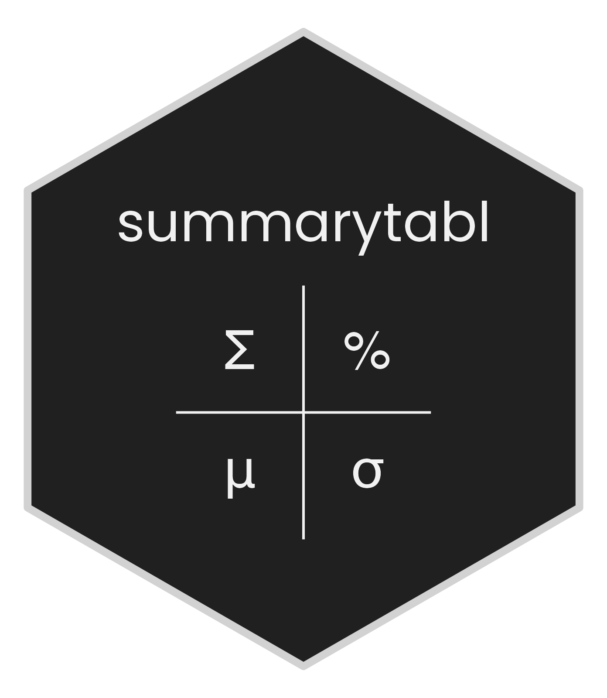

# summarytabl 

summarytabl is an R package that provides functions for tabulating and summarizing continuous, ordinal, and categorical variables in data frames. summarytabl is designed to streamline descriptive analysis of categorical, ordinal, and continuous data. Whether you’re working on a report or presentation, summarytabl simplifies the process of summarizing your data for insightful interpretation and effective communication.  

## Installation

Install the summarytabl package from CRAN using the following command:

```r
install.packages("summarytabl")
```

For the latest updates, install the development version of the package from GitHub:

```r
remotes::install_github("anyamemensah/summarytabl", build_vignettes = TRUE)
```

## Learn more

For more information on how to use the package, please refer to the [Introduction to summarytabl](articles/summarytabl-intro.html) article.

<br>

If this package has been helpful in your work and you’d like to see it continue to grow, consider supporting its development by:

* Scheduling a consulting session with Ama Nyame-Mensah (<ama@anyamemensah.com>) to learn how to integrate summarytabl into your projects.
* [Citing](https://anyamemensah.github.io/summarytabl/authors.html#citation) the package.
* Contributing to the documentation by [submitting an issue](https://github.com/anyamemensah/summarytabl/issues) or joining the discussion on a [pull request](https://github.com/anyamemensah/summarytabl/pulls).

